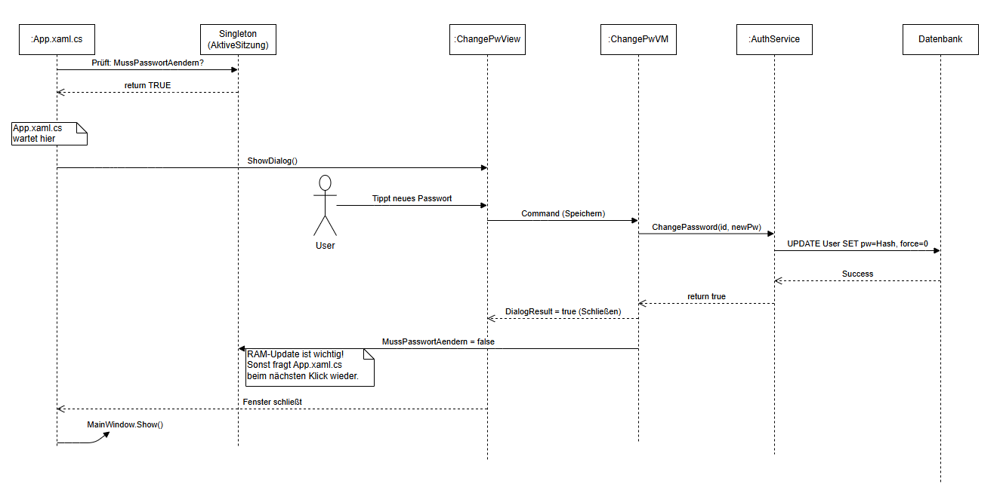

# Modul-Dokumentation: Passwort-Änderung

Dieses Modul behandelt den Prozess der erzwungenen Passwort-Änderung (z.B. beim ersten Login oder nach einem Reset durch den Administrator).

---

## 1. Ablaufdiagramm
Der technische Ablauf zwischen View, ViewModel, Service und Datenbank wird im folgenden Sequenzdiagramm dargestellt:



**Kurzbeschreibung des Ablaufs:**
1.  **App.xaml.cs:** Erkennt beim Start das Flag `MussPasswortAendern == true`.
2.  **View:** Öffnet modal (`ShowDialog`). Der Programmstart wartet an dieser Stelle.
3.  **User:** Gibt das neue Passwort ein und klickt "Speichern".
4.  **ViewModel:** Validiert die Eingabe nicht selbst, sondern delegiert an den `AuthenticationService`.
5.  **Service:** Aktualisiert das Passwort in der Datenbank (als Hash) und setzt das Flag `MussPasswortAendern` auf `0` (false).
6.  **Ergebnis:** Bei Erfolg liefert das Fenster `DialogResult = true` zurück, und `App.xaml.cs` setzt den Startvorgang fort.

---

## 2. Exkurs: INotifyPropertyChanged

Die Schnittstelle `INotifyPropertyChanged` ist essentiell für das MVVM-Pattern. Sie ermöglicht die **Datenbindung** (Data Binding) zwischen Logik und Oberfläche.

### 2.1 Kommunikationsrichtung
Es ist wichtig, zwischen zwei Richtungen zu unterscheiden:

* **GUI -> Code:** Wenn der Benutzer eine Eingabe tätigt (z.B. in eine TextBox), wird der Wert durch das Binding **automatisch** in die ViewModel-Eigenschaft geschrieben. Hierfür wird kein Event benötigt.
* **Code -> GUI:** Wenn der C#-Code einen Wert ändert (z.B. durch Laden aus der Datenbank oder Berechnung), weiß die Oberfläche davon nichts. Hier wird `INotifyPropertyChanged` benötigt, um der View mitzuteilen: "Lade diesen Wert neu aus dem Speicher".

### 2.2 Analyse der Methode `OnPropertyChanged`

Die Standard-Implementierung dieser Methode enthält einige C#-spezifische Besonderheiten, die hier zerlegt werden:

```csharp
protected void OnPropertyChanged([CallerMemberName] string propertyName = null)
{
    PropertyChanged?.Invoke(this, new PropertyChangedEventArgs(propertyName));
}
```

#### A. Die Methodenkopf-Komponenten

* **`protected`**:
    Die Methode ist nur innerhalb der Klasse (oder vererbten Klassen) sichtbar. Sie kann nicht von außen (z.B. aus anderen Klassen) aufgerufen werden.

* **`[CallerMemberName]`**:
    Ein Attribut des Compilers. Wenn die Methode ohne Parameter aufgerufen wird (nur `OnPropertyChanged()`), ermittelt der Compiler automatisch den Namen der aufrufenden Eigenschaft und setzt ihn ein. Dies verhindert Tippfehler bei String-Übergaben.

* **`string propertyName = null`**:
    Der Parameter ist optional. Wird nichts übergeben, ist er zunächst `null`, wird aber durch das Attribut (siehe oben) gefüllt.

#### B. Der Aufruf und das Fragezeichen (`?.`)

Die Zeile `PropertyChanged?.Invoke(...)` nutzt den sogenannten **Null-Conditional Operator**.

1.  **Das Problem:** Das Event `PropertyChanged` ist `null`, solange kein Abonnent (kein Fenster) darauf "hört". Ein direkter Aufruf (`PropertyChanged.Invoke(...)`) würde in diesem Fall zum Absturz führen (`NullReferenceException`).
2.  **Die Lösung:** Das Fragezeichen prüft vor der Ausführung, ob das Event ungleich `null` ist.

**Vergleich der Schreibweisen:**

Modern (Kurz):
```csharp
PropertyChanged?.Invoke(this, ...);
```

Klassisch (Lang):
```csharp
if (PropertyChanged != null)
{
    PropertyChanged.Invoke(this, ...);
}
```

### 2.3 Zusammenfassung
Die Methode `OnPropertyChanged` dient als sicherer Auslöser für das Event. Sie sorgt dafür, dass die Benutzeroberfläche über interne Zustandsänderungen informiert wird und sich visuell aktualisiert.