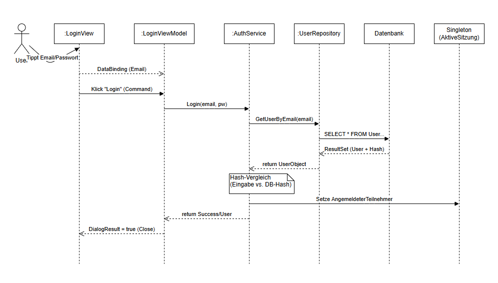

# Modul-Dokumentation: Login & Authentifizierung

Diese Dokumentation beschreibt die Umsetzung des Login-Prozesses unter Verwendung des MVVM-Musters und des Singleton-Patterns.

---

## 1. Ablaufdiagramm
Den schematischen Ablauf finden Sie hier:



Der Prozess folgt dem Schema:
1.  **View:** Benutzer gibt Daten ein und betätigt "Anmelden".
2.  **ViewModel:** Empfängt den Befehl und ruft den `AuthenticationService` auf.
3.  **Service:** Prüft Anmeldedaten gegen die Datenbank (Repository).
4.  **Singleton:** Bei Erfolg wird der User in `AktiveSitzung` gespeichert.
5.  **App.xaml.cs:** Erhält das Ergebnis und entscheidet über den Programmstart.

---

## 2. Exkurs: MVVM und das Command-Pattern

In der klassischen Windows-Forms- oder einfachen WPF-Entwicklung wird Logik oft direkt an UI-Ereignisse gekoppelt (z. B. `Button_Click` in der `Code-Behind`-Datei). Im **MVVM-Architekturmuster** (Model-View-ViewModel) wird dieser Ansatz vermieden, um eine saubere Trennung zwischen Oberfläche (View) und Logik (ViewModel) zu gewährleisten.

### 2.1 Das Problem klassischer Events
Wird Code direkt in die `LoginWindow.xaml.cs` geschrieben (Code-Behind), entstehen folgende Nachteile:
* **Hohe Kopplung:** Die Logik ist fest mit dem Button verbunden.
* **Schlechte Testbarkeit:** Automatisierte Unit-Tests können keine Buttons "klicken", um Logik zu prüfen.
* **Keine Wiederverwendbarkeit:** Die Logik kann nicht einfach von einem anderen Auslöser (z. B. Drücken der Enter-Taste) genutzt werden.

### 2.2 Die Lösung: ICommand
Anstelle von Events nutzt MVVM **Commands**.
`ICommand` ist eine Schnittstelle (Interface) aus dem .NET-Framework, die definiert, wie ein Befehl strukturiert sein muss. Ein Command besteht aus zwei Hauptkomponenten:

1.  **Execute:** Die Methode, die ausgeführt wird (Was soll getan werden?).
2.  **CanExecute:** Eine Methode, die prüft, ob der Befehl ausgeführt werden darf (Darf der Button geklickt werden?).

**Vorteil für die UI:** WPF-Steuerelemente wie `Button` erkennen `ICommand`-Objekte automatisch. Wenn `CanExecute` "falsch" zurückgibt, deaktiviert sich der Button (`IsEnabled="False"`) automatisch. Dies spart manuellen Code zur UI-Steuerung.

### 2.3 Der Vermittler: RelayCommand
Da `ICommand` nur ein Interface ist, muss es implementiert werden. Um nicht für jede Aktion (Login, Abbruch, Speichern, Löschen) eine eigene Klasse schreiben zu müssen, wird eine generische Hilfsklasse verwendet: der **`RelayCommand`**.

Der `RelayCommand` fungiert als Container. Er nimmt die Logik aus dem ViewModel (als Methoden-Delegaten) entgegen und verpackt sie in ein `ICommand`-Objekt, das die View versteht.

**Zusammenspiel im Detail:**

1.  **Im ViewModel (Logik):**
    Es wird eine Methode definiert, die die eigentliche Arbeit verrichtet (z. B. `ExecuteLogin`).
    ```csharp
    // Die eigentliche Arbeits-Methode
    private void ExecuteLogin(object parameter)
    {
        // Aufruf des AuthenticationService...
    }
    ```

2.  **Die Command-Eigenschaft (Schnittstelle):**
    Das ViewModel stellt eine öffentliche Eigenschaft vom Typ `ICommand` bereit. Im Konstruktor wird diese mit einem neuen `RelayCommand` initialisiert. Dabei wird auf die Arbeits-Methode verwiesen.
    ```csharp
    public ICommand LoginCommand { get; }

    public LoginViewModel()
    {
        // Der RelayCommand verbindet den Befehl mit der Methode
        LoginCommand = new RelayCommand(ExecuteLogin, CanExecuteLogin);
    }
    ```

3.  **In der View (XAML):**
    Der Button wird per `Binding` an diese Eigenschaft gebunden.
    ```xml
    <Button Command="{Binding LoginCommand}" Content="Anmelden" />
    ```

**Zusammenfassung des Ablaufs:**
Wird der Button geklickt, ruft er nicht direkt C#-Code auf. Er ruft den `RelayCommand` auf. Dieser leitet ("relays") den Aufruf an die im ViewModel hinterlegte Methode (`ExecuteLogin`) weiter.

---

## 3. Singleton Pattern (`AktiveSitzung.cs`)

Das Singleton-Muster stellt sicher, dass eine Klasse nur genau **einmal** instanziiert wird. Dies dient als zentraler Speicher für die aktuelle Benutzersitzung.

### Implementierung
```csharp
// 1. Private statische Variable (der Speicher)
private static AktiveSitzung _instance;

// 2. Privater Konstruktor (Verhindert "new AktiveSitzung()" von außen)
private AktiveSitzung() { ... }

// 3. Öffentlicher Zugriff (Die Schleuse)
public static AktiveSitzung Instance
{
    get
    {
        // Lazy Initialization: Die Instanz wird erst erstellt, wenn sie benötigt wird.
        if (_instance == null)
            _instance = new AktiveSitzung();
        return _instance;
    }
}